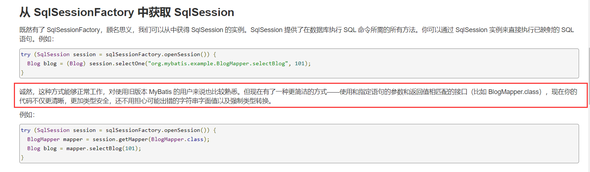

# mybatis学习
## 相关链接
官网链接：https://mybatis.org/mybatis-3/zh/index.html

mybatis源码：https://github.com/mybatis/mybatis-3

## mybatis项目
### 创建maven项目
### 删除src目录
### 父pom导入依赖
### 创建子模块
#### 编写mybatis核心配置文件
```xml
<?xml version="1.0" encoding="UTF-8" ?>
<!DOCTYPE configuration
        PUBLIC "-//mybatis.org//DTD Config 3.0//EN"
        "http://mybatis.org/dtd/mybatis-3-config.dtd">
<!--核心配置文件-->
<configuration>
<!-- environments表示环境，这里的environments是复数，表示可以有多套环境，默认取 环境id叫development的环境  -->
    <environments default="development">
<!--   environment id="development"，此套环境的环境id叫 development    -->
        <environment id="development">
<!--    transactionManager，默认用JDBC的事务管理        -->
            <transactionManager type="JDBC"/>
            <dataSource type="POOLED">
                <!--数据库驱动-->
                <property name="driver" value="com.mysql.jdbc.Driver"/>
                <!--&amp在这里就表示&符号，如果不使用amp，xml文件会报错-->
                <property name="url" value="jdbc:mysql://localhost:3306/smbms?useSSL=true&amp;useUnicode=true&amp;characterEncoding=UTF-8"/>
                <property name="username" value="root"/>
                <property name="password" value="123456"/>
            </dataSource>
        </environment>
<!--    环境id叫test的环境    -->
        <environment id="test">
            <transactionManager type="JDBC"/>
            <dataSource type="POOLED">
                <property name="driver" value="${driver}"/>
                <property name="url" value="${url}"/>
                <property name="username" value="${username}"/>
                <property name="password" value="${password}"/>
            </dataSource>
        </environment>
    </environments>
    <mappers>
        <mapper resource="org/mybatis/example/BlogMapper.xml"/>
    </mappers>
</configuration>
```
#### 编写加载sqlsessionfactory工具类
```java
package com.huang.utils;

import org.apache.ibatis.builder.SqlSourceBuilder;
import org.apache.ibatis.io.Resources;
import org.apache.ibatis.session.SqlSession;
import org.apache.ibatis.session.SqlSessionFactory;
import org.apache.ibatis.session.SqlSessionFactoryBuilder;

import java.io.IOException;
import java.io.InputStream;

/**
 * @ClassName MybatisUtils
 * @Description TODO
 * @Author huangbo1221
 * @Date 2022/1/15 20:49
 * @Version 1.0
 */

/**
 * 每个基于 MyBatis 的应用都是以一个 SqlSessionFactory 的实例为核心的。
 * SqlSessionFactory 的实例可以通过 SqlSessionFactoryBuilder 获得。
 * 而 SqlSessionFactoryBuilder 则可以从 XML 配置文件或一个预先配置的 Configuration
 * 实例来构建出 SqlSessionFactory 实例。
 */
public class MybatisUtils {
    private static SqlSessionFactory sqlSessionFactory;
    static {
        String path = "mybatis-config.xml";
        try {
            // 使用mybqtis的第一步，先获取SqlSessionFactory对象
            InputStream resourceAsStream = Resources.getResourceAsStream(path);
            sqlSessionFactory = new SqlSessionFactoryBuilder().build(resourceAsStream);
        } catch (IOException e) {
            e.printStackTrace();
        }
    }

    /**
     * 既然有了 SqlSessionFactory，顾名思义，我们可以从中获得 SqlSession 的实例。
     * SqlSession 提供了在数据库执行 SQL 命令所需的所有方法。你可以通过 SqlSession
     * 实例来直接执行已映射的 SQL 语句。
     * @return SqlSession
     */
    public static SqlSession getSqlSession() {
        SqlSession sqlSession = sqlSessionFactory.openSession();
        return sqlSession;
    }
}
```
#### 实体类
```java
package com.huang.pojo;

import lombok.Data;
import lombok.NoArgsConstructor;

/**
 * @ClassName User
 * @Description TODO
 * @Author huangbo1221
 * @Date 2022/1/15 21:01
 * @Version 1.0
 */
@Data
@NoArgsConstructor
public class User {
    private int id;

    private String userName;

    private String userCode;
}
```
#### DAO接口
```java
package com.huang.dao;

import com.huang.pojo.User;

import java.util.List;

/**
 * @ClassName UserDao
 * @Description TODO
 * @Author huangbo1221
 * @Date 2022/1/15 21:04
 * @Version 1.0
 */
public interface UserDao {
    public List<User> getUserList();
}
```
#### 接口实现类由原来的UserDaoImpl转为一个mapper配置文件
```xml
<?xml version="1.0" encoding="UTF-8" ?>
<!DOCTYPE mapper
        PUBLIC "-//mybatis.org//DTD Mapper 3.0//EN"
        "http://mybatis.org/dtd/mybatis-3-mapper.dtd">
<!--namespace:命名空间，想要与哪个dao/mapper的接口扯上关系，就要映射到哪里。这里的配置文件实际就取到了以前实现的dao的实现类-->
<mapper namespace="com.huang.dao.UserDao">
    <select id="getUserList" resultType="com.huang.pojo.User">
        select id, userCode, userName from smbms_user
    </select>
</mapper>
```
#### 测试
junit测试
```java
package com.huang.dao;

import com.huang.pojo.User;
import com.huang.utils.MybatisUtils;
import org.apache.ibatis.session.SqlSession;
import org.junit.Test;

import java.util.List;

/**
 * @ClassName UserDaoTest
 * @Description TODO
 * @Author huangbo1221
 * @Date 2022/1/15 21:27
 * @Version 1.0
 */
public class UserDaoTest {
    @Test
    public void test01() {
        // 第一步：获取sqlsession来执行sql
        SqlSession sqlSession = MybatisUtils.getSqlSession();

        // 执行sql的所有方式
        // 方式一：getMapper
        UserDao userDao = sqlSession.getMapper(UserDao.class);
        List<User> userList = userDao.getUserList();
        userList.forEach(user -> System.out.println(user));

        System.out.println("===============================================");
        // 方式二：指定调用的方法
        List<User> objectList = sqlSession.selectList("com.huang.dao.UserDao.getUserList");
        objectList.forEach(user -> System.out.println(user));
        // 如果查询单条数据，则使用sqlSession.selectOne
        // 关掉会话，避免内存泄漏
        sqlSession.close();
    }

}
```
结果
```shell
User(id=1, userName=系统管理员, userCode=admin)
User(id=2, userName=李明, userCode=liming)
User(id=5, userName=韩路彪, userCode=hanlubiao)
User(id=6, userName=张华, userCode=zhanghua)
User(id=7, userName=王洋, userCode=wangyang)
User(id=8, userName=赵燕, userCode=zhaoyan)
User(id=10, userName=孙磊, userCode=sunlei)
User(id=11, userName=孙兴, userCode=sunxing)
User(id=12, userName=张晨, userCode=zhangchen)
User(id=13, userName=邓超, userCode=dengchao)
User(id=14, userName=杨过, userCode=yangguo)
User(id=15, userName=赵敏, userCode=zhaomin)
===============================================
User(id=1, userName=系统管理员, userCode=admin)
User(id=2, userName=李明, userCode=liming)
User(id=5, userName=韩路彪, userCode=hanlubiao)
User(id=6, userName=张华, userCode=zhanghua)
User(id=7, userName=王洋, userCode=wangyang)
User(id=8, userName=赵燕, userCode=zhaoyan)
User(id=10, userName=孙磊, userCode=sunlei)
User(id=11, userName=孙兴, userCode=sunxing)
User(id=12, userName=张晨, userCode=zhangchen)
User(id=13, userName=邓超, userCode=dengchao)
User(id=14, userName=杨过, userCode=yangguo)
User(id=15, userName=赵敏, userCode=zhaomin)
```

针对两种方法，官方解释如下：



### CRUD
1、namespace中的包名要和Dao/mapper接口的包名一致
2、增删改查。note：增删改需要提交事务才能更新数据库
```xml
<?xml version="1.0" encoding="UTF-8" ?>
<!DOCTYPE mapper
        PUBLIC "-//mybatis.org//DTD Mapper 3.0//EN"
        "http://mybatis.org/dtd/mybatis-3-mapper.dtd">
<!--namespace:命名空间，想要与哪个dao/mapper的接口扯上关系，就要映射到哪里。这里的配置文件实际就取到了以前实现的dao的实现类-->
<mapper namespace="com.huang.dao.UserMapper">
    <select id="getUserList" resultType="com.huang.pojo.User">
        select id, userCode, userName from smbms_user
    </select>

    <select id="getUserById" parameterType="Integer" resultType="com.huang.pojo.User">
        select id, userName, userCode from smbms_user where id = #{id}
    </select>

    <!--对象中的属性，可以直接取出来-->
    <insert id="addUser" parameterType="com.huang.pojo.User">
        insert into smbms_user (id, userName, userCode) values (#{id}, #{userName}, #{userCode})
    </insert>

    <update id="updateUserById" parameterType="com.huang.pojo.User">
        update smbms_user
        set userName = #{userName}, userCode = #{userCode}
        where id = #{id};
    </update>

    <delete id="deleteUserById" parameterType="Integer">
        delete from smbms_user where id = #{id}
    </delete>
</mapper>
```

```java
package com.huang.dao;

import com.huang.pojo.User;

import java.util.List;

/**
 * @ClassName UserDao
 * @Description TODO
 * @Author huangbo1221
 * @Date 2022/1/15 21:04
 * @Version 1.0
 */
public interface UserMapper {
    // 获取全部用户
    List<User> getUserList();

    // 根据id查询用户
    User getUserById(Integer id);

    // 增加一个用户
    public void addUser(User user);

    // 更新用户
    void updateUserById(User user);

    // 删除一个用户
    void deleteUserById(Integer id);
}
```

### 万能的map
map中的值属性，可以直接在mapper中取出来
values后面的参数，key可以按照自定义的key来，不受传参对象的限制
```xml
<!--
  map中的值属性，可以直接取出来
  values后面的参数，key可以按照自定义的key来，不受传参对象的限制
  -->
<insert id="addUserByMap" parameterType="Map">
    insert into smbms_user (id, userName, userCode, address) values (#{id}, #{name}, #{code}, #{address})
</insert>
```

```java
 @Test
public void  test06() {
    SqlSession sqlSession = null;

    try {
        sqlSession = MybatisUtils.getSqlSession();
        Map<String, Object> userMap = new HashMap<>();
        userMap.put("id", 9);
        userMap.put("name", "bobo");
        userMap.put("code", "666666");
        userMap.put("address", "beijing");
        UserMapper mapper = sqlSession.getMapper(UserMapper.class);
        mapper.addUserByMap(userMap);
        sqlSession.commit();
    } catch (Exception e) {
        e.printStackTrace();
    } finally {
        sqlSession.close();
    }
}
```

