# mybatis学习
## 相关链接
官网链接：https://mybatis.org/mybatis-3/zh/index.html

mybatis源码：https://github.com/mybatis/mybatis-3

## mybatis项目
### 创建maven项目
### 删除src目录
### 父pom导入依赖
### 创建子模块
#### 编写mybatis核心配置文件
```xml
<?xml version="1.0" encoding="UTF-8" ?>
<!DOCTYPE configuration
        PUBLIC "-//mybatis.org//DTD Config 3.0//EN"
        "http://mybatis.org/dtd/mybatis-3-config.dtd">
<!--核心配置文件-->
<configuration>
<!-- environments表示环境，这里的environments是复数，表示可以有多套环境，默认取 环境id叫development的环境  -->
    <environments default="development">
<!--   environment id="development"，此套环境的环境id叫 development    -->
        <environment id="development">
<!--    transactionManager，默认用JDBC的事务管理        -->
            <transactionManager type="JDBC"/>
            <dataSource type="POOLED">
                <!--数据库驱动-->
                <property name="driver" value="com.mysql.jdbc.Driver"/>
                <!--&amp在这里就表示&符号，如果不使用amp，xml文件会报错-->
                <property name="url" value="jdbc:mysql://localhost:3306/smbms?useSSL=true&amp;useUnicode=true&amp;characterEncoding=UTF-8"/>
                <property name="username" value="root"/>
                <property name="password" value="123456"/>
            </dataSource>
        </environment>
<!--    环境id叫test的环境    -->
        <environment id="test">
            <transactionManager type="JDBC"/>
            <dataSource type="POOLED">
                <property name="driver" value="${driver}"/>
                <property name="url" value="${url}"/>
                <property name="username" value="${username}"/>
                <property name="password" value="${password}"/>
            </dataSource>
        </environment>
    </environments>
    <mappers>
        <mapper resource="org/mybatis/example/BlogMapper.xml"/>
    </mappers>
</configuration>
```
#### 编写加载sqlsessionfactory工具类
```java
package com.huang.utils;

import org.apache.ibatis.builder.SqlSourceBuilder;
import org.apache.ibatis.io.Resources;
import org.apache.ibatis.session.SqlSession;
import org.apache.ibatis.session.SqlSessionFactory;
import org.apache.ibatis.session.SqlSessionFactoryBuilder;

import java.io.IOException;
import java.io.InputStream;

/**
 * @ClassName MybatisUtils
 * @Description TODO
 * @Author huangbo1221
 * @Date 2022/1/15 20:49
 * @Version 1.0
 */

/**
 * 每个基于 MyBatis 的应用都是以一个 SqlSessionFactory 的实例为核心的。
 * SqlSessionFactory 的实例可以通过 SqlSessionFactoryBuilder 获得。
 * 而 SqlSessionFactoryBuilder 则可以从 XML 配置文件或一个预先配置的 Configuration
 * 实例来构建出 SqlSessionFactory 实例。
 */
public class MybatisUtils {
    private static SqlSessionFactory sqlSessionFactory;
    static {
        String path = "mybatis-config.xml";
        try {
            // 使用mybqtis的第一步，先获取SqlSessionFactory对象
            InputStream resourceAsStream = Resources.getResourceAsStream(path);
            sqlSessionFactory = new SqlSessionFactoryBuilder().build(resourceAsStream);
        } catch (IOException e) {
            e.printStackTrace();
        }
    }

    /**
     * 既然有了 SqlSessionFactory，顾名思义，我们可以从中获得 SqlSession 的实例。
     * SqlSession 提供了在数据库执行 SQL 命令所需的所有方法。你可以通过 SqlSession
     * 实例来直接执行已映射的 SQL 语句。
     * @return SqlSession
     */
    public static SqlSession getSqlSession() {
        SqlSession sqlSession = sqlSessionFactory.openSession();
        return sqlSession;
    }
}
```
#### 实体类
```java
package com.huang.pojo;

import lombok.Data;
import lombok.NoArgsConstructor;

/**
 * @ClassName User
 * @Description TODO
 * @Author huangbo1221
 * @Date 2022/1/15 21:01
 * @Version 1.0
 */
@Data
@NoArgsConstructor
public class User {
    private int id;

    private String userName;

    private String userCode;
}
```
#### DAO接口
```java
package com.huang.dao;

import com.huang.pojo.User;

import java.util.List;

/**
 * @ClassName UserDao
 * @Description TODO
 * @Author huangbo1221
 * @Date 2022/1/15 21:04
 * @Version 1.0
 */
public interface UserDao {
    public List<User> getUserList();
}
```
#### 接口实现类由原来的UserDaoImpl转为一个mapper配置文件
```xml
<?xml version="1.0" encoding="UTF-8" ?>
<!DOCTYPE mapper
        PUBLIC "-//mybatis.org//DTD Mapper 3.0//EN"
        "http://mybatis.org/dtd/mybatis-3-mapper.dtd">
<!--namespace:命名空间，想要与哪个dao/mapper的接口扯上关系，就要映射到哪里。这里的配置文件实际就取到了以前实现的dao的实现类-->
<mapper namespace="com.huang.dao.UserDao">
    <select id="getUserList" resultType="com.huang.pojo.User">
        select id, userCode, userName from smbms_user
    </select>
</mapper>
```
#### 测试
junit测试
```java
package com.huang.dao;

import com.huang.pojo.User;
import com.huang.utils.MybatisUtils;
import org.apache.ibatis.session.SqlSession;
import org.junit.Test;

import java.util.List;

/**
 * @ClassName UserDaoTest
 * @Description TODO
 * @Author huangbo1221
 * @Date 2022/1/15 21:27
 * @Version 1.0
 */
public class UserDaoTest {
    @Test
    public void test01() {
        // 第一步：获取sqlsession来执行sql
        SqlSession sqlSession = MybatisUtils.getSqlSession();

        // 执行sql的所有方式
        // 方式一：getMapper
        UserDao userDao = sqlSession.getMapper(UserDao.class);
        List<User> userList = userDao.getUserList();
        userList.forEach(user -> System.out.println(user));

        System.out.println("===============================================");
        // 方式二：指定调用的方法
        List<User> objectList = sqlSession.selectList("com.huang.dao.UserDao.getUserList");
        objectList.forEach(user -> System.out.println(user));
        // 如果查询单条数据，则使用sqlSession.selectOne
        // 关掉会话，避免内存泄漏
        sqlSession.close();
    }

}
```
结果
```shell
User(id=1, userName=系统管理员, userCode=admin)
User(id=2, userName=李明, userCode=liming)
User(id=5, userName=韩路彪, userCode=hanlubiao)
User(id=6, userName=张华, userCode=zhanghua)
User(id=7, userName=王洋, userCode=wangyang)
User(id=8, userName=赵燕, userCode=zhaoyan)
User(id=10, userName=孙磊, userCode=sunlei)
User(id=11, userName=孙兴, userCode=sunxing)
User(id=12, userName=张晨, userCode=zhangchen)
User(id=13, userName=邓超, userCode=dengchao)
User(id=14, userName=杨过, userCode=yangguo)
User(id=15, userName=赵敏, userCode=zhaomin)
===============================================
User(id=1, userName=系统管理员, userCode=admin)
User(id=2, userName=李明, userCode=liming)
User(id=5, userName=韩路彪, userCode=hanlubiao)
User(id=6, userName=张华, userCode=zhanghua)
User(id=7, userName=王洋, userCode=wangyang)
User(id=8, userName=赵燕, userCode=zhaoyan)
User(id=10, userName=孙磊, userCode=sunlei)
User(id=11, userName=孙兴, userCode=sunxing)
User(id=12, userName=张晨, userCode=zhangchen)
User(id=13, userName=邓超, userCode=dengchao)
User(id=14, userName=杨过, userCode=yangguo)
User(id=15, userName=赵敏, userCode=zhaomin)
```

针对两种方法，官方解释如下：


### CRUD
1、namespace中的包名要和Dao/mapper接口的包名一致
2、增删改查。note：增删改需要提交事务才能更新数据库
```xml
<?xml version="1.0" encoding="UTF-8" ?>
<!DOCTYPE mapper
        PUBLIC "-//mybatis.org//DTD Mapper 3.0//EN"
        "http://mybatis.org/dtd/mybatis-3-mapper.dtd">
<!--namespace:命名空间，想要与哪个dao/mapper的接口扯上关系，就要映射到哪里。这里的配置文件实际就取到了以前实现的dao的实现类-->
<mapper namespace="com.huang.dao.UserMapper">
    <select id="getUserList" resultType="com.huang.pojo.User">
        select id, userCode, userName from smbms_user
    </select>

    <select id="getUserById" parameterType="Integer" resultType="com.huang.pojo.User">
        select id, userName, userCode from smbms_user where id = #{id}
    </select>

    <!--对象中的属性，可以直接取出来-->
    <insert id="addUser" parameterType="com.huang.pojo.User">
        insert into smbms_user (id, userName, userCode) values (#{id}, #{userName}, #{userCode})
    </insert>

    <update id="updateUserById" parameterType="com.huang.pojo.User">
        update smbms_user
        set userName = #{userName}, userCode = #{userCode}
        where id = #{id};
    </update>

    <delete id="deleteUserById" parameterType="Integer">
        delete from smbms_user where id = #{id}
    </delete>
</mapper>
```

```java
package com.huang.dao;

import com.huang.pojo.User;

import java.util.List;

/**
 * @ClassName UserDao
 * @Description TODO
 * @Author huangbo1221
 * @Date 2022/1/15 21:04
 * @Version 1.0
 */
public interface UserMapper {
    // 获取全部用户
    List<User> getUserList();

    // 根据id查询用户
    User getUserById(Integer id);

    // 增加一个用户
    public void addUser(User user);

    // 更新用户
    void updateUserById(User user);

    // 删除一个用户
    void deleteUserById(Integer id);
}
```

### 万能的map
map中的值属性，可以直接在mapper中取出来
values后面的参数，key可以按照自定义的key来，不受传参对象的限制
```xml
<!--
  map中的值属性，可以直接取出来
  values后面的参数，key可以按照自定义的key来，不受传参对象的限制
  -->
<insert id="addUserByMap" parameterType="Map">
    insert into smbms_user (id, userName, userCode, address) values (#{id}, #{name}, #{code}, #{address})
</insert>
```

```java
 @Test
public void  test06() {
    SqlSession sqlSession = null;

    try {
        sqlSession = MybatisUtils.getSqlSession();
        Map<String, Object> userMap = new HashMap<>();
        userMap.put("id", 9);
        userMap.put("name", "bobo");
        userMap.put("code", "666666");
        userMap.put("address", "beijing");
        UserMapper mapper = sqlSession.getMapper(UserMapper.class);
        mapper.addUserByMap(userMap);
        sqlSession.commit();
    } catch (Exception e) {
        e.printStackTrace();
    } finally {
        sqlSession.close();
    }
}
```

### 配置解析
```xml
configuration（配置）
properties（属性）
settings（设置）
typeAliases（类型别名）
typeHandlers（类型处理器）
objectFactory（对象工厂）
plugins（插件）
environments（环境配置）
environment（环境变量）
transactionManager（事务管理器）
dataSource（数据源）
databaseIdProvider（数据库厂商标识）
mappers（映射器）
```

#### environments
MyBatis 可以配置成适应多种环境，这种机制有助于将 SQL 映射应用于多种
数据库之中， 现实情况下有多种理由需要这么做。例如，开发、测试和生产环境
需要有不同的配置；或者想在具有相同 Schema 的多个生产数据库中使用相同的
SQL 映射。还有许多类似的使用场景。
**尽管可以配置多个环境，但每个 SqlSessionFactory 实例只能选择一种环境。**

#### 属性（properties）
我们可以通过properties属性来实现应用配置文件.
这些属性可以在外部进行配置，并可以进行动态替换。你既可以在典型的 
Java 属性文件中配置这些属性，也可以在 properties 元素的子元素中设置。
(1)编写db.properties文件
```properties
driver=com.mysql.jdbc.Driver
url=jdbc:mysql://localhost:3306/smbms?useSSL=true&useUnicode=true&characterEncoding=UTF-8
username=root
password=123456
```
(2)在核心配置文件中引入该文件
如果在mybatis-config.xml文件最后面使用properties标签，则会出现如下报错：


表明，标签的配置都是有其使用顺序的！！！
```properties
 <!-- 引入外部配置文件    -->
<properties resource="db.properties">
    <property name="password" value="11111"/>
</properties>
```
* 可以直接引入外部配置文件
* 可以在properties标签里面增加属性
   外部配置文件优先级最低，但是若property对应的属性和外部配置文件具有相同的
key时，则外部配置文件的值会覆盖property属性的值。因为，低优先级时最后读取的！

#### 类型别名（typeAliases）
类型别名可为 Java 类型设置一个缩写名字。 它仅用于 XML 配置，意在降低冗余的全限定类名书写。
方式1：
直接指定某个类
```xml
<!--给实体类起别名-->
<typeAliases>
    <typeAlias type="com.huang.pojo.User" alias="User"/>
</typeAliases>
```
方式2：
扫描包
```xml
<!--给实体类起别名-->
<typeAliases>
    <package name="com.huang.pojo"/>
</typeAliases>
```


虽然官方文档说会用小写首字母作为别名，但是实际上大写也是可以的！

#### 映射器（mappers）
方式一：
```xml
<mappers>
    <!--一个个注册-->
    <mapper resource="com/huang/dao/UserMapper.xml"/>
</mappers>
```

方式二：使用class文件绑定注册
```xml
<mappers>
    <!--class引入-->
    <mapper class="com.huang.dao.UserMapper"/>
</mappers>
```
**注意**：
* 接口和他的mapper配置文件必须同名！
* 接口和他的mapper配置文件必须在同一个包下！

方式三：
包扫描
```xml
<mappers>
        <!--包扫描-->
    <package name="com.huang.dao"/>
</mappers>
```
**注意**：
* 接口和他的mapper配置文件必须同名！
* 接口和他的mapper配置文件必须在同一个包下！
  可以在resources下面建一个同名目录来放置mapper配置文件

#### 生命周期和作用域
生命周期和作用域是至关重要的，因为错误的使用会导致非常严重的并发问题！
（1）SqlSessionFactory
* 说白了就可以想象为：数据库连接池
* SqlSessionFactory一旦被创建就应该在应用的运行期间一直存在，没有任何理由丢弃它
或者重建另一个实例
* SqlSessionFactory的最佳作用域是应用作用域
* 最简单的就是单例模式或者静态单例模式

(SqlSession)
* 连接到连接池的一个请求
* SqlSession的实例不是线程安全的，因此是不能被共享的，所以他的最佳作用域是请求或
方法作用域
* 用完之后需要赶紧关闭，否则资源被占用


#### 解决属性名和字段名不一致的问题
数据库字段如下：

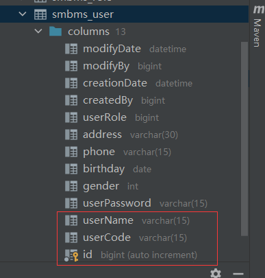

实体类字段如下：

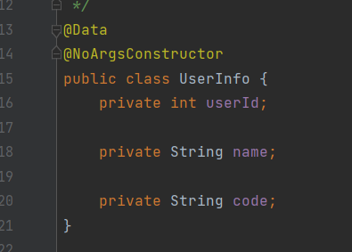

测试结果如下：
```java
package com.huang.dao;

import com.huang.pojo.User;
import com.huang.pojo.UserInfo;
import com.huang.utils.MybatisUtils;
import org.apache.ibatis.session.SqlSession;
import org.junit.Test;

import java.util.List;

/**
 * @ClassName UserDaoTest
 * @Description TODO
 * @Author huangbo1221
 * @Date 2022/1/15 21:27
 * @Version 1.0
 */
public class UserInfoMapperTest {
    @Test
    public void test02() {
        SqlSession sqlSession = null;

        try {
            sqlSession = MybatisUtils.getSqlSession();
            UserInfoMapper mapper = sqlSession.getMapper(UserInfoMapper.class);
            UserInfo user = mapper.getUserById(1);
            System.out.println(user);
        } catch (Exception e) {
            e.printStackTrace();
        } finally {
            sqlSession.close();
        }
    }
}
```

结果如下：
```shell
UserInfo(id=1, name=null, code=null)
```

name和code字段为空。很好理解，因为执行的sql相当于如下：
```xml
select id, userName, userCode from smbms_user where id = #{id}
```
实体类没有字段和userName、userCode一一映射！

解决办法一：
```shell
select id, userName as name , userCode as code from smbms_user where id = #{id}
```

解决办法二：
resultMap结果集映射
```xml
<?xml version="1.0" encoding="UTF-8" ?>
<!DOCTYPE mapper
        PUBLIC "-//mybatis.org//DTD Mapper 3.0//EN"
        "http://mybatis.org/dtd/mybatis-3-mapper.dtd">
<!--namespace:命名空间，想要与哪个dao/mapper的接口扯上关系，就要映射到哪里。这里的配置文件实际就取到了以前实现的dao的实现类-->
<mapper namespace="com.huang.dao.UserInfoMapper">
    <resultMap id="resUserInfo" type="UserInfo">
        <!--column表示数据库字段，property表示实体类的属性 -->
        <!--id属性可以不用写出来，即下面的第一行可以注释掉。数据库字段和实体类字段一致
         时，会自动匹配-->
        <result column="id" property="id"></result>
        <result column="userName" property="name"></result>
        <result column="userCode" property="code"></result>
    </resultMap>
    <select id="getUserById" parameterType="Integer" resultMap="resUserInfo">
        select id, userName, userCode from smbms_user where id = #{id}
    </select>
</mapper>
```

### 日志
#### 日志工厂
如果数据库操作出现了异常，我们需要拍错，日志时最好的助手！

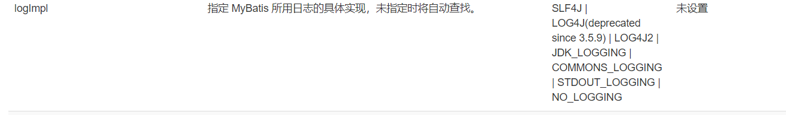

SLF4J
LOG4J(deprecated since 3.5.9)
LOG4J2【掌握】
JDK_LOGGING
COMMONS_LOGGING
STDOUT_LOGGING【掌握】
NO_LOGGING

在mybatis中具体使用哪一个日志实现，在设置中指定。
STDOUT_LOGGING：标准日志输出

```xml
<settings>
    <setting name="logImpl" value="STDOUT_LOGGING"/>
</settings>
```

执行sql时输出如下：

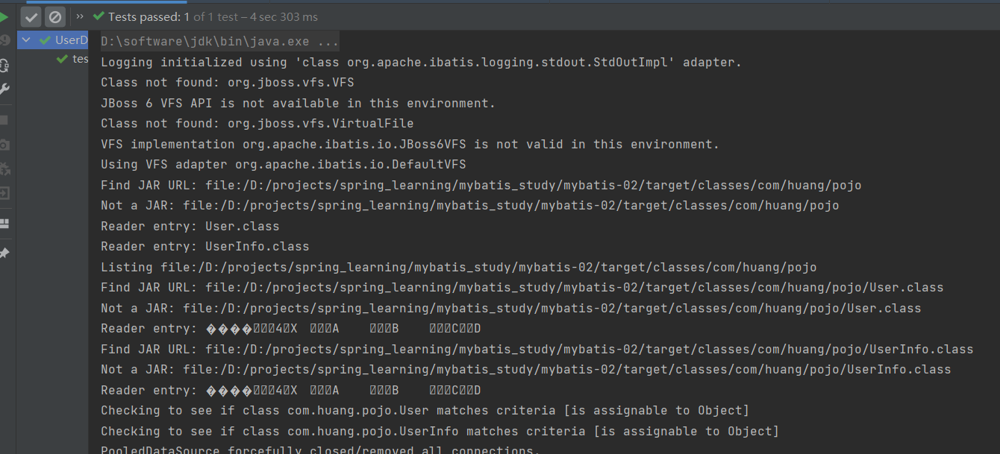

#### log4j2
* Log4j是Apache的一个开源项目，通过使用Log4j，我们可以控制日志信息输 送的目的地是控制台、文件、GUI组件，甚至是套接口
服务器、NT的事件记录器、 UNIX Syslog守护进程等；
* 我们也可以控制每一条日志的输出格式；
* 通过定义 每一条日志信息的级别，我们能够更加细致地控制日志的生成过程。最令人感兴 趣的就是，这些可以通过一个配置文件来灵活地进行配置，而不需要修改应用的代码。

1、先导入log4j2的包
```xml
<!-- https://mvnrepository.com/artifact/log4j/log4j -->
<dependency>
    <groupId>log4j</groupId>
    <artifactId>log4j</artifactId>
    <version>1.2.17</version>
</dependency>
```

2、log4j.properties
```properties
# 将等级为debug的日志信息输出到console和file两个目的地，console和file的定义见下面的代码
log4j.rootLogger=DEBUG,console,file

# 控制台输出的相关设置
log4j.appender.console=org.apache.log4j.ConsoleAppender
log4j.appender.console.Target=System.out
log4j.appender.console.Threshold=DEBUG
log4j.appender.console.layout=org.apache.log4j.PatternLayout
log4j.appender.console.layout.ConversionPattern=[%c]-%m%n

# 文件输出的相关设置
log4j.appender.file=org.apache.log4j.RollingFileAppender
log4j.appender.file.File=./log/bo.log
log4j.appender.file.MaxFileSize=10mb
log4j.appender.file.Threshold=DEBUG
log4j.appender.file.layout=org.apache.log4j.PatternLayout
log4j.appender.file.layout.ConversionPattern=[%p][%d{yy-MM-dd}][%c]-%m%n

# 日志输出级别
log4j.logger.org.mybatis=DEBUG
log4j.logger.java.sql=DEBUG
log4j.logger.java.sql.Statement=DEBUG
log4j.logger.java.sql.ResultSet=DEBUG
log4j.logger.java.sql.PrepareStatement=DEBUG
```

3、配置log4j为日志的实现
```xml
<settings>
    <setting name="logImpl" value="LOG4J"/>
</settings>
```

4、log4j的使用

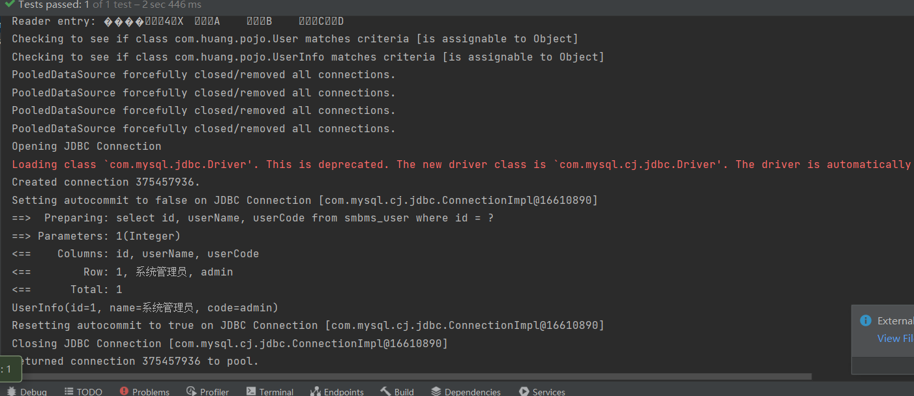

简单使用
```java
package com.huang.dao;

import com.huang.pojo.User;
import com.huang.pojo.UserInfo;
import com.huang.utils.MybatisUtils;
import org.apache.ibatis.session.SqlSession;
import org.apache.log4j.Logger;
import org.junit.Test;

import java.util.List;

/**
 * @ClassName UserDaoTest
 * @Description TODO
 * @Author huangbo1221
 * @Date 2022/1/15 21:27
 * @Version 1.0
 */
public class UserInfoMapperTest {
    private static final Logger logger = Logger.getLogger(UserInfoMapperTest.class);

    @Test
    public void test02() {
        SqlSession sqlSession = null;

        try {
            sqlSession = MybatisUtils.getSqlSession();
            UserInfoMapper mapper = sqlSession.getMapper(UserInfoMapper.class);
            UserInfo user = mapper.getUserById(1);
            System.out.println(user);
        } catch (Exception e) {
            e.printStackTrace();
        } finally {
            sqlSession.close();
        }
    }

    @Test
    public void test01() {
        logger.info("enter UserInfoMapperTest.test01 method!");
        System.out.println("hhhhhh");
        logger.info("finish test01 method!");
    }
}
```

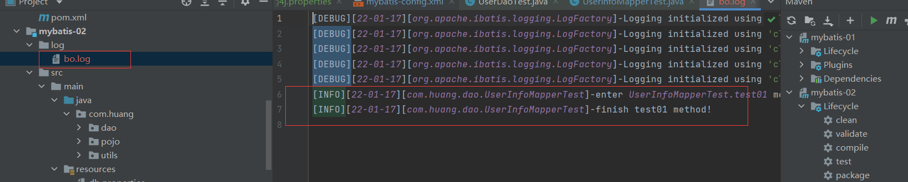

### 分页
#### Limit实现分页
```xml
<select id="getUserByLimit" parameterType="Map" resultMap="resUserInfo">
    select id, userName, userCode from smbms_user limit #{startIndex}, #{pageSize}
</select>
```

#### RowBounds实现分页
```xml
<!--  sql先查出所有的用户  -->
<select id="getUserByRowBounds" resultMap="resUserInfo">
    select id, userName, userCode from smbms_user
</select>
```

```java
 @Test
public void test04() {
    SqlSession sqlSession = null;

    try {
        sqlSession = MybatisUtils.getSqlSession();
        // 采用RowBounds来实现分页
        RowBounds rowBounds = new RowBounds(0, 2);
        List<UserInfo> userInfos = sqlSession.selectList("com.huang.dao.UserInfoMapper.getUserByRowBounds", null, rowBounds);
        userInfos.forEach(userInfo -> System.out.println(userInfo));
    } catch (Exception e) {
        e.printStackTrace();
    } finally {
        sqlSession.close();
    }
}
```

#### 使用pageHelper分页插件

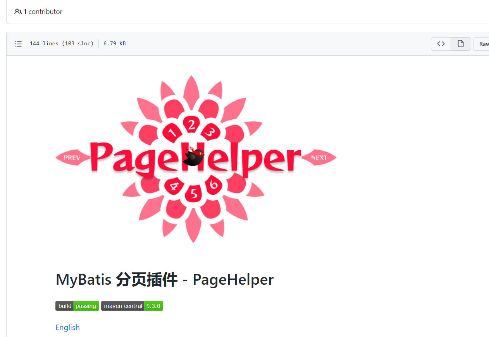

### 使用注解开发 mybatis-03模块
#### dao文件开发（不需在写mapper.xml文件！）
```java
package huang.dao;

import huang.pojo.User;
import org.apache.ibatis.annotations.Select;

import java.util.List;
import java.util.Map;

/**
 * @ClassName UserDao
 * @Description TODO
 * @Author huangbo1221
 * @Date 2022/1/15 21:04
 * @Version 1.0
 */
public interface UserMapper {
    // 获取全部用户
    @Select("select id, userCode, userName from smbms_user")
    List<User> getUserList();
}
```

#### xml文件注册接口
```xml
<mappers>
    <!--一个个注册-->
    <mapper class="huang.dao.UserMapper"/>
</mappers>
```

**核心：** mybatis底层就是反射加动态代理！

### 使用注解的方式实现CRUD
```java
package huang.dao;

import huang.pojo.User;
import org.apache.ibatis.annotations.*;

import java.util.List;
import java.util.Map;

/**
 * @ClassName UserDao
 * @Description TODO
 * @Author huangbo1221
 * @Date 2022/1/15 21:04
 * @Version 1.0
 */
public interface UserMapper {
    // 获取全部用户
    @Select("select id, userCode, userName from smbms_user")
    List<User> getUserList();

    @Select("select id, userCode, userName from smbms_user where id = #{id}")
    User getUserById(@Param("id") int id);

    @Insert("insert into smbms_user (id, userCode, UserName) values (#{id}, #{userCode}, #{userName})")
    void addUser(User user);

    @Update("update smbms_user set userCode = #{userCode}, userName = #{userName} where id = #{id}")
    void updateUserById(@Param("id") int id, @Param("userCode") String userCode, @Param("userName") String userName);

    @Delete("delete from smbms_user where id = #{id}")
    void deleteUserById(@Param("id") int id);
}
```

#### 注意#{}和${}的区别！！！

### 多对一
#### 了解外键的概念
```mysql
CREATE TABLE `teacher` (
`id` INT(10) NOT NULL,
`name` VARCHAR(30) DEFAULT NULL,
PRIMARY  KEY(`id`)
) ENGINE=INNODB DEFAULT CHARSET=utf8;

INSERT INTO teacher (id, NAME) VALUES (1, 'huangbo');  

CREATE TABLE `student` (
`id` INT(10) NOT NULL PRIMARY KEY,
`name` VARCHAR(30) DEFAULT NULL,
`tid` INT(10) DEFAULT NULL,
KEY `fktid` (`tid`),
CONSTRAINT `fktid` FOREIGN KEY (`tid`) REFERENCES `teacher` (`id`)
) ENGINE=INNODB DEFAULT CHARSET=utf8

INSERT INTO student (id, NAME, tid) VALUES(1,'xiaoming', 1); -- success
INSERT INTO student (id, NAME, tid) VALUES(2,'xiaohuang', 1);-- success
INSERT INTO student (id, NAME, tid) VALUES(3,'xiaozhang', 1);-- success
INSERT INTO student (id, NAME, tid) VALUES(4,'xiaoli', 1);-- success
INSERT INTO student (id, NAME, tid) VALUES(5,'xiaochen', 1);-- success
INSERT INTO student (id, NAME, tid) VALUES(6,'xiaohong', 2);-- failed!
```

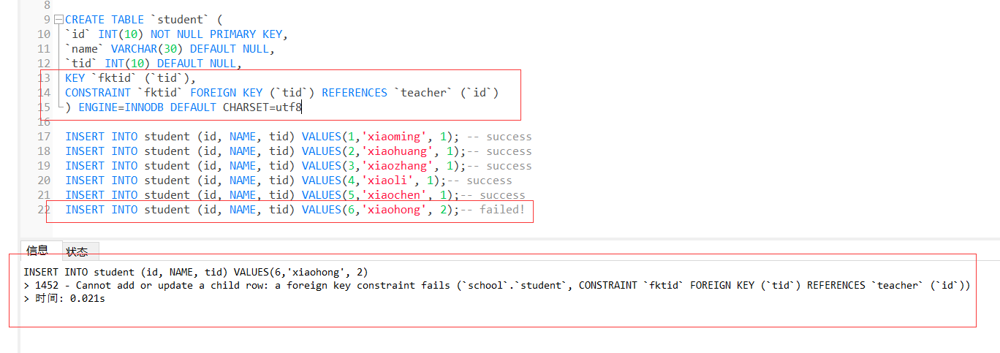

#### 按照查询嵌套处理
```xml
<?xml version="1.0" encoding="UTF-8" ?>
<!DOCTYPE mapper
        PUBLIC "-//mybatis.org//DTD Config 3.0//EN"
        "http://mybatis.org/dtd/mybatis-3-mapper.dtd">
<!--核心配置文件-->
<mapper namespace="huang.dao.StudentMapper">
    <select id="getAllStudents" resultMap="studentModel">
        select id, name, tid from student
    </select>

    <resultMap id="studentModel" type="huang.pojo.Student">
        <result property="id" column="id"></result>
        <result property="name" column="name"></result>
        <association property="teacher" column="tid" javaType="huang.pojo.Teacher" select="getTeacher"></association>
    </resultMap>

    <select id="getTeacher" resultType="huang.pojo.Teacher">
        select id, name from teacher where id = #{tid}
    </select>
</mapper>
```

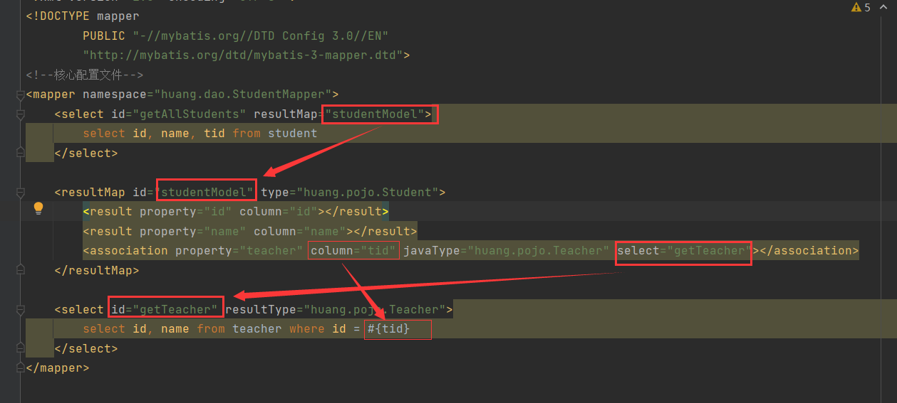

就相当于嵌套查询

#### 按照查询结果处理
```xml
<resultMap id="stuModel" type="huang.pojo.Student">
    <result property="id" column="sid"></result>
    <result property="name" column="sname"></result>
    <association property="teacher" javaType="huang.pojo.Teacher">
        <result property="id" column="tid"></result>
        <result property="name" column="tname"></result>
    </association>
</resultMap>

<select id="getAllStudents2" resultMap="stuModel">
    SELECT
        stu.id as sid,
        stu.`name` as sname,
        t.id as tid,
        t.`name` as tname
    FROM
        student stu
    LEFT JOIN teacher t ON t.id = stu.tid
</select>
```

### 一对多的处理
```xml
<?xml version="1.0" encoding="UTF-8" ?>
<!DOCTYPE mapper
        PUBLIC "-//mybatis.org//DTD Config 3.0//EN"
        "http://mybatis.org/dtd/mybatis-3-mapper.dtd">
<!--核心配置文件-->
<mapper namespace="huang.dao.TeacherMapper">
    <resultMap id="teacherModel" type="huang.pojo.Teacher">
        <result property="id" column="tid"></result>
        <result property="name" column="tname"></result>
        <collection property="students" ofType="huang.pojo.Student">
            <result property="id" column="sid"></result>
            <result property="name" column="sname"></result>
        </collection>
    </resultMap>

    <select id="getTeacherAndStuById" resultMap="teacherModel">
        SELECT
            t.id AS tid,
            t.NAME AS tname,
            stu.id AS sid,
            stu.NAME AS sname
        FROM
            teacher t
        LEFT JOIN student stu ON t.id = stu.tid
    </select>
</mapper>
```

#### 小结
1、关联--association 【多对一】

2、集合--collection  【一对多】

3、javaType ofType

### 动态sql
#### if判断
```xml
<select id="queryBlogByIf" parameterType="Map" resultType="blog">
    select * from blog
    where 1=1
    <if test="title != null">
        and title like #{title}
    </if>
    <if test="author != null">
        and author = #{author}
    </if>
</select>
```

#### choose、when、otherwise
有时候，我们不想使用所有的条件，而只是想从多个条件中选择一个使用。针对这种情况，
MyBatis 提供了 choose 元素， 它有点像 Java 中的 switch 语句。
```xml
<select id="queryBlogByChoose" parameterType="Map" resultType="blog">
    select * from blog
    <where>
        <choose>
            <when test="title != null">
                and title like #{title}
            </when>
            <when test="author != null">
                and author = #{author}
            </when>
            <otherwise>
                and views = #{views}
            </otherwise>
        </choose>
    </where>
</select>
```

#### trim、where、set
掌握where标签的使用，相当于where 1=1的功能
```xml
<select id="queryBlogByIf" parameterType="Map" resultType="blog">
    select * from blog
    <where>
        <if test="title != null">
            title like #{title}
        </if>
        <if test="author != null">
            and author = #{author}
        </if>
    </where>
</select>
```

掌握set标签的使用，可以方便去除后缀的','
```xml
<update id="updateBlog" parameterType="Map">
    UPDATE blog
        <set>
            <if test="title != null">
                title = #{title},
            </if>
            <if test="author != null">
                author = #{author},
            </if>
        </set>
        where id = #{id}
</update>
```

#### sql片段
在开发过程中，会经常在xml写各种sql，有些sql会写很多遍，显得很重复。可以将其提取成
公共sql，然后在其他sql中引用公共sql。如下：
```xml
<sql id="commonsql">
    <if test="title != null">
        title like #{title}
    </if>
    <if test="author != null">
        and author = #{author}
    </if>
</sql>

<select id="queryBlogByIf" parameterType="Map" resultType="blog">
    select * from blog
    <where>
        <include refid="commonsql"></include>
    </where>
</select>
```

#### foreach用法
1、第一种
```mysql
select * from blog where views in (2,3)
```

效果如下：

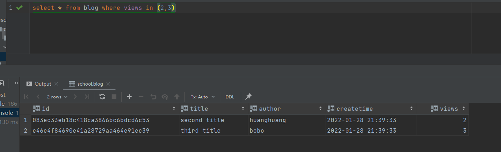

写成动态sql如下：
```xml
<select id="getBlogsByForEach1" parameterType="Map" resultType="com.huang.pojo.Blog">
    select * from blog
        <where>
            <if test="viewsMap != null">
                views in
                <foreach collection="viewsMap" index="index" item="view" open="(" separator="," close=")">
                    #{view}
                </foreach>
            </if>
        </where>
</select>
```

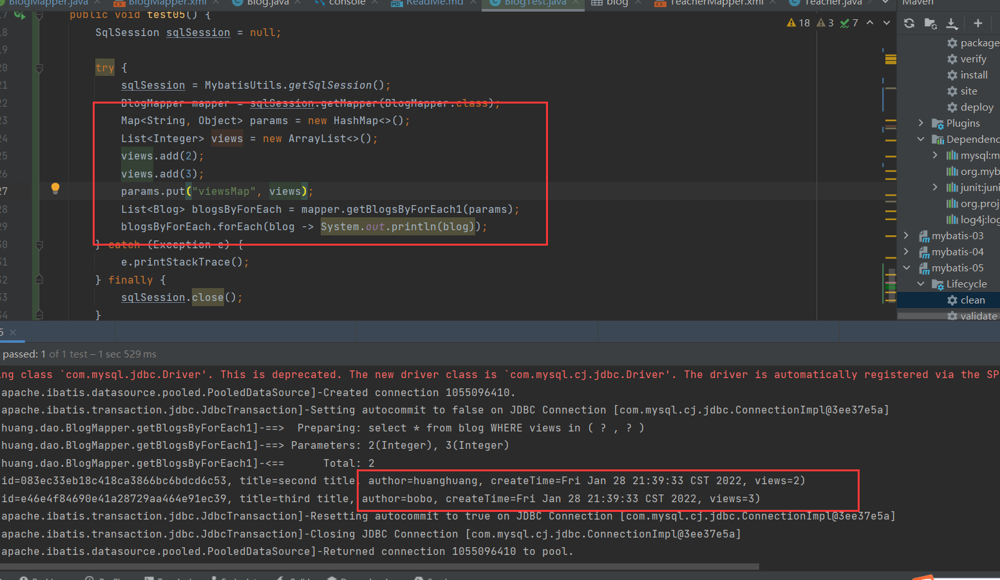


2、第二种
```mysql
select * from blog where 1=1 and (views = 2 or views = 3)
```

效果如下：

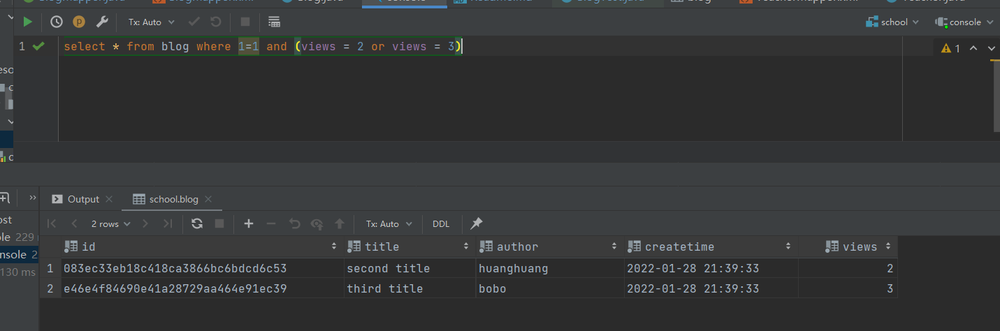

动态sql如下：
```xml
<select id="getBlogsByForEach2" parameterType="Map" resultType="com.huang.pojo.Blog">
    select * from blog
        <where>
            <if test="viewsMap != null">
                <foreach collection="viewsMap" item="view" index="index" open="(" separator="or" close=")">
                    views = #{view}
                </foreach>
            </if>
        </where>
</select>
```

执行效果：

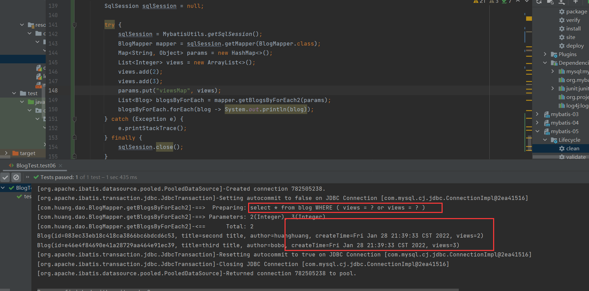

