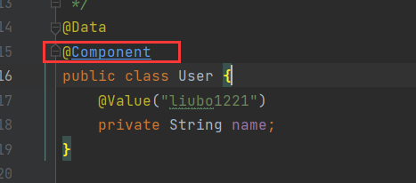

# IOC思想
先用一个简单的实例来讲一下IOC（控制反转）的思想，如下：
先实现一个UserDao、UserDaoImpl。
再在业务层实现一个UserService和UserServiceImpl。
注意UserServiceImpl的实现如下：
```java
private UserDao userDao = new UserDaoImpl();

@Override
public void getUsers() {
    userDao.getUsers();
}
```
直接由业务自己在私有成员上初始化了一个dao层的实现类实例，这种方式
极为笨拙！

然后在模拟一个用户MyTest，如下：
```java
public class MyTest01 {

    // 相当于一个真实的用户
    public static void main(String[] args) {
        UserService userService = new UserServiceImpl();
        userService.getUsers();
    }
}
```
输出如下：
```shell
use UserDaoImpl!
```
由输出结果可知，也能达到调dao层的目的。

但是，如果此时用户想用mybatis来取代自己的数据库，业务仍要能够调到
dao层，应该怎么做呢？
首先应该实现一个UserMybatisImpl实现类。
那业务层还得继续适配修改，如下：
```java
private UserDao userDao = new UserMybatisImpl();

@Override
public void getUsers() {
    userDao.getUsers();
}
```
如上，业务得修改成员变量的初始化dao层实现对象！！！
输出如下：
```shell
use UserMybatisImpl!
```
在修改了业务层代码后达到了效果！

若用户又切到sqlserver呢？？
同样，在dao层实现一个UserSqlServerImpl类。然后业务层又得继续修改：
```java
private UserDao userDao = new UserSqlServerImpl();

@Override
public void getUsers() {
    userDao.getUsers();
}
```
输出如下：
```shell
use UserSqlServerImpl!
```

如上，用户需求的变动得反复修改业务层，若代码量很庞大，则费时费力。
这样的设计肯定会相当差！

有一种方式可以去解决这种问题，不直接初始化业务层的成员变量，而是采用
动态set的方式，如下：
```java
private UserDao userDao;

public void setUserDao(UserDao userDao) {
    this.userDao = userDao;
}

@Override
public void getUsers() {
    userDao.getUsers();
}
```

这种情况下，用户调用时，应该以如下方式：
```java
public class MyTest01 {

    // 相当于一个真实的用户
    public static void main(String[] args) {
        UserService userService = new UserServiceImpl();
        // 这里无法执行userService.setUserDao方法，是因为多态无法利用父类调用子类特有的方法！
        // 得强转成UserServiceImpl
        ((UserServiceImpl)userService).setUserDao(new UserSqlServerImpl());
        userService.getUsers();
    }
}
```
输出如下：
```shell
use UserSqlServerImpl!
```

此时，用户再想切oracle时，实现一个UserOracleDaoimpl即可。
不用再修改业务层！！
用户调用时，主动指定什么类型的数据库即可。如下：
```java
public class MyTest01 {

    // 相当于一个真实的用户
    public static void main(String[] args) {
        UserService userService = new UserServiceImpl();
        // 这里无法执行userService.setUserDao方法，是因为多态无法利用父类调用子类特有的方法！
        // 得强转成UserServiceImpl
        ((UserServiceImpl)userService).setUserDao(new UserOracleDaoimpl());
        userService.getUsers();
    }
}
```
输出如下：
```shell
use UserOracleDaoimpl!
```

上面的变化其实就是一种IOC的原型，将控制权由业务层交给了用户，给
用户自己去选择！

当然，也可以完全采用spring的方式来进行上面效果的实现，spring配置如beans.xml。
```xml
<?xml version="1.0" encoding="UTF-8"?>
<beans xmlns="http://www.springframework.org/schema/beans"
       xmlns:xsi="http://www.w3.org/2001/XMLSchema-instance"
       xsi:schemaLocation="http://www.springframework.org/schema/beans http://www.springframework.org/schema/beans/spring-beans.xsd">


    <bean id="mybatis" class="com.huang.ioc01.UserDao.UserMybatisImpl"></bean>
    <bean id="oracle" class="com.huang.ioc01.UserDao.UserOracleDaoimpl"></bean>
    <bean id="sqlServer" class="com.huang.ioc01.UserDao.UserSqlServerImpl"></bean>

    <bean id="userservice" class="com.huang.ioc01.UserService.UserServiceImpl">
        <property name="userDao" ref="mybatis"></property>
    </bean>
</beans>
```
```java
@Test
public void test01() {
    ApplicationContext context = new ClassPathXmlApplicationContext("beans.xml");
    UserService userservice = (UserService) context.getBean("userservice");
    userservice.getUsers();
    }
```
输出如下：
use UserMybatisImpl!

想引用哪类sql，只需改变上面xml的配置文件的ref值即可。
即将对象的创建、赋值等交给了spring容器管理。这也就是所谓的IOC（控制反转）。

# IOC的创建方式
1、默认使用bean的无参构造来创建对象；
2、可以使用有参构造来创建对象；
* 使用有参构造的下标赋值方式，如下：
```xml
<!--  有参构造的下表赋值方式  -->
    <bean id="user" class="com.huang.bo.pojo.User">
        <constructor-arg index="0" value="huangbo"></constructor-arg>
    </bean>
```

* 使用参数类型的方式来构造
```xml
<bean id="userType" class="com.huang.bo.pojo.User">
    <constructor-arg type="java.lang.String" value="liubo"></constructor-arg>
</bean>
```
但是有一个弊端，当构造方法有多个string时，统一都是一样的值，因此不推荐使用！

* 参数名来直接赋值创建
```xml
<bean id="userPara" class="com.huang.bo.pojo.User">
    <constructor-arg name="name" value="liubo1221"></constructor-arg>
</bean>
```
输出如下：
```java
@Test
public void test04() {
    ApplicationContext context = new ClassPathXmlApplicationContext("beans.xml");
    User user = (User) context.getBean("userPara");
    System.out.println(user.toString());
}
```
```shell
User{name='liubo1221'}
```
这种方式最为直观！！！

# Spring配置
（1）别名
```xml
<alias name="user" alias="userAlias"></alias>
```
如上，可以通过user或者userAlias获取同样的bean

（2）bean的配置
```xml
<!--
id:bean的唯一标志符，也就是相当于我们学的对象名；
class:bean对象所对应的全限定名，包名+类型
name:也是别名，而且name可以同时取多个别名
-->
<bean id="userId" class="com.huang.bo.pojo.User" name="user2 user3,user4">
    <constructor-arg name="name" value="huangbo1221"></constructor-arg>
</bean>
```
（3）import
这个import一般用于团队开发使用，可以将多个配置文件，导入合并为1个。
```xml
<?xml version="1.0" encoding="UTF-8"?>
<beans xmlns="http://www.springframework.org/schema/beans"
       xmlns:xsi="http://www.w3.org/2001/XMLSchema-instance"
       xsi:schemaLocation="http://www.springframework.org/schema/beans http://www.springframework.org/schema/beans/spring-beans.xsd">

    <import resource="beans.xml"></import>
    <import resource="beans2.xml"></import>
    <import resource="beans3.xml"></import>

</beans>
```
如上，开发分别搞了三个xml配置文件beans.xml、beans2.xml、beans3.xml.
我们使用的时候并不需要全部分开导入，而是可以新建一个applicationcontext.xml，内容
如上。使用时，直接获取applicationcontext.xml即可获取到所有的bean。

# DI 依赖注入
（1）构造注入
如前面讲的spring利用构造方法来创建对象
（2）set方式注入【重点】
  * 依赖：bean对象的创建依赖容器！
  * 注入：bean对象中的所有属性，由容器来注入！

【环境搭建】
如spring_day_02模块下的所有文件

# 命名空间注入
如下示例：
```xml
<?xml version="1.0" encoding="UTF-8"?>
<beans xmlns="http://www.springframework.org/schema/beans"
       xmlns:xsi="http://www.w3.org/2001/XMLSchema-instance"
       xmlns:p="http://www.springframework.org/schema/p"
       xmlns:c="http://www.springframework.org/schema/c"
       xsi:schemaLocation="http://www.springframework.org/schema/beans http://www.springframework.org/schema/beans/spring-beans.xsd">

<!--  p命名空间注入，可以直接注入属性的值，这里的p就相当于property  -->
    <bean id="user" class="com.huang.bo.pojo.User" p:name="huangbo" p:age="18"></bean>
<!--  p命名空间注入，构造器注入，这里的c就相当于constructor-arg  -->
    <bean id="user2" class="com.huang.bo.pojo.User" c:name="huang" c:age="18"></bean>
</beans>
```

# scope作用域
```xml
<!-- 单例模式，spring的默认机制   -->
    <bean id="user3" class="com.huang.bo.pojo.User" scope="singleton"></bean>
<!-- 原型模式，每次从容器get的时候，都会产生一个新对象   -->
    <bean id="user4" class="com.huang.bo.pojo.User" scope="prototype"></bean>
```

```java
@Test
    public void test04() {
        ApplicationContext context = new ClassPathXmlApplicationContext("userBeans.xml");
        User user3 = (User) context.getBean("user3");
        User user4 = (User) context.getBean("user3");
        System.out.println(user3 == user4);
    }
// 输出true
    
    @Test
    public void test05() {
        ApplicationContext context = new ClassPathXmlApplicationContext("userBeans.xml");
        User user4 = context.getBean("user4", User.class);
        User user5 = context.getBean("user4", User.class);
        System.out.println(user4 == user5);
    }
// 输出false
```

# bean的自动装配
* 自动装配时spring满足bean依赖的一种方式
* spring会在上下文中自动寻找，并自动给bean装配属性

在spring中有三种装配的方式
1、在xml中显示配置
2、在java中显示配置
3、隐式的自动装配bean【重要】

(1)
```xml
<!--  1、最普通的一种配置方式  -->
<bean id="cat" class="com.huang.pojo.Cat"></bean>
<bean id="dog" class="com.huang.pojo.Dog"></bean>
<bean id="person" class="com.huang.pojo.Person">
    <property name="name" value="huangbo1221"></property>
    <property name="cat" ref="cat"></property>
    <property name="dog" ref="dog"></property>
</bean>
```

```java
@Test
public void test01() {
    ApplicationContext context = new ClassPathXmlApplicationContext("beans.xml");
    Person person = context.getBean("person", Person.class);
    person.getCat().shout();
    person.getDog().shout();
}
```
```shell
miao~
wang~
```

(2)
ByName的自动装配方式，要求bean的id全局唯一
```xml
<!--
  byName:会自动在容器上下文中查找，和自己对象set方法后面的值对应的beanid！
  如下这种方式也可以自动加载成功
  -->
<bean id="person2" class="com.huang.pojo.Person" autowire="byName">
    <property name="name" value="huangbo1221"></property>
</bean>
```
```java
@Test
public void test02() {
    ApplicationContext context = new ClassPathXmlApplicationContext("beans.xml");
    Person person = context.getBean("person2", Person.class);
    person.getCat().shout();
    person.getDog().shout();
}
```
```shell
miao~
wang~
```

ByType的自动装配方式，要求bean的class全局唯一
```xml
<!--  ByType自动装配，通过set方法的入参类型来自动装配  -->
    <bean id="person3" class="com.huang.pojo.Person" autowire="byType">
        <property name="name" value="huangbo1111"></property>
    </bean>
```

(3)使用注解的方式自动装配
* 导入约束
```xml
<?xml version="1.0" encoding="UTF-8"?>
<beans xmlns="http://www.springframework.org/schema/beans"
       xmlns:xsi="http://www.w3.org/2001/XMLSchema-instance"
       xmlns:context="http://www.springframework.org/schema/context"
       xsi:schemaLocation="http://www.springframework.org/schema/beans
       http://www.springframework.org/schema/beans/spring-beans.xsd
       http://www.springframework.org/schema/context
       http://www.springframework.org/schema/context/spring-context.xsd">
```

* 注册bean
```xml
<!--  定义一个”手“的bean  -->
    <bean id="hands" class="com.huang.pojo.Hands"></bean>
```

* 自动注入
```java
package com.huang.pojo;

import lombok.Data;
import org.springframework.beans.factory.annotation.Autowired;

/**
 * @ClassName Person
 * @Description TODO
 * @Author huangbo1221
 * @Date 2022/1/8 21:09
 * @Version 1.0
 */
@Data
public class Person {
    private Cat cat;

    private Dog dog;

    private String name;

    @Autowired
    private Hands hands;
}

```

* 验证
```java
@Test
public void test03() {
    ApplicationContext context = new ClassPathXmlApplicationContext("beans.xml");
    Person person = context.getBean("person2", Person.class);
    person.getCat().shout();
    person.getDog().shout();
    person.getHands().useHands();
}
```

* 输出如下
```java
miao~
wang~
shake hands!
```

**注意**
使用@Autowired注解注入bean的时候，可以不用实现set方法，前提是你这个自动装配的属性
在IOC（Sping）容器中存在，且符合ByType规则！
如下：当class不唯一的时候，person3的注入就会报错！！！


当使用@Autowired注解，且bean存在两个一样的class类型时，如下：
```xml
<!--  定义一个”手“的bean  -->
<bean id="hands" class="com.huang.pojo.Hands">
    <property name="name" value="first"></property>
</bean>
<bean id="hands2" class="com.huang.pojo.Hands">
<property name="name" value="second"></property>
</bean>

<bean id="monkey" class="com.huang.pojo.Monkey"></bean>
```

新版的idea不会再报错，而是默认采用第一个class类型，验证如下：
```java
@Test
public void test05() {
    ApplicationContext context = new ClassPathXmlApplicationContext("beans.xml");
    Monkey monkey = context.getBean("monkey", Monkey.class);
    System.out.println(monkey.getHands().toString());
}
```
输出如下：
```shell
Hands(name=first)
```

此时，可以采用@Qualifier来指定使用哪一个，如下：
```java
package com.huang.pojo;

import lombok.Data;
import org.springframework.beans.factory.annotation.Autowired;
import org.springframework.beans.factory.annotation.Qualifier;

/**
 * @ClassName Monkey
 * @Description TODO
 * @Author huangbo1221
 * @Date 2022/1/8 22:14
 * @Version 1.0
 */
@Data
public class Monkey {

    @Autowired
    @Qualifier(value = "hands2")
    private Hands hands;
}

```

输出如下：
```java
@Test
public void test05() {
    ApplicationContext context = new ClassPathXmlApplicationContext("beans.xml");
    Monkey monkey = context.getBean("monkey", Monkey.class);
    System.out.println(monkey.getHands().toString());
}
```
输出如下：
```shell
Hands(name=second)
```

## @Resource注解
相当于@Autowired
@Qualifier(value = "hands2")结合起来使用

小结：
@Resource和@Autowired的区别
* 都是用来自动装配的，都可以放在属性字段上；
* @Autowired通过ByType的方式实现，而且必须要求这个对象存在！【常用】
* @Resource默认通过ByName的方式实现，如果找不到名字，则通过ByType的方式实现！
如果两个都找不到的情况下就报错。【常用】
* 执行顺序不同：@Autowired通过ByType的方式实现，Resource默认通过ByName的方式实现

# 使用注解开发
## @Component注解，将类注册成bean，相当于在spring的xml文件里进行配置！
```java
package com.huang.pojo;

import lombok.Data;
import org.springframework.stereotype.Component;

/**
 * @ClassName User
 * @Description TODO
 * @Author huangbo1221
 * @Date 2022/1/9 17:22
 * @Version 1.0
 */
// 这里的@Component注解相当于xml文件里配置的<bean id="user" class="com.huang.pojo.User"></bean>
@Component
@Data
public class User {
    private String name = "huangbo1221";
}
```

验证结果如下：
```java
@Test
public void test01() {
    ApplicationContext context = new ClassPathXmlApplicationContext("applicationContext.xml");
    User user1 = context.getBean("user", User.class);
    System.out.println(user1.getName());
    User user2 = context.getBean("user", User.class);
    System.out.println(user1 == user2);
    }
```
```shell
huangbo1221
true
```
如上，可以正常获取结果，而且默认采用的单例模式来创建对象

## 属性的注入
```java
package com.huang.pojo;

import lombok.Data;
import org.springframework.beans.factory.annotation.Value;
import org.springframework.stereotype.Component;

/**
 * @ClassName User
 * @Description TODO
 * @Author huangbo1221
 * @Date 2022/1/9 17:22
 * @Version 1.0
 */
// 这里的@Component注解相当于xml文件里配置的<bean id="user" class="com.huang.pojo.User"></bean>
@Component
@Data
public class User {
    /**
     * <bean id="user" class="com.huang.pojo.User">
     *         <property name="name" value="liubo"></property>
     * </bean>
     */
    @Value("liubo")
    private String name = "huangbo1221";
}

```
验证如下：
```java
@Test
public void test01() {
    ApplicationContext context = new ClassPathXmlApplicationContext("applicationContext.xml");
    User user1 = context.getBean("user", User.class);
    System.out.println(user1.getName());
}
```
输出：
```shell
liubo
```
可见，生效的是注解上的默认值

## 衍生的注解
@Component有几个衍生注解，我们在web开发中吗，会按照MVC三层架构分层！
* dao【@Repository】
* service【@Service】
* controller【@Controller】
这四个注解的功能都是一样的，都是代表将某个类注册到spring中，装配bean。

注意：这些注解的用法及概念不要弄混了，上面的四个注解是标注在一个类上的，作用是将被标注的类注册在spring容器
中，将类的实例化交给spring管理，完成的是bean的注册。
@Autowired是标注在类中的成员变量上的，完成的是bean的注入，当一个class A需要一个B类型的变量时，在声明变量
时加上这个注解，spring会在容器中寻找有没有这个bean。

## 注解注册bean的时候声明scope
```java
package com.huang.pojo;

import lombok.Data;
import org.springframework.beans.factory.annotation.Value;
import org.springframework.context.annotation.Scope;
import org.springframework.stereotype.Component;

/**
 * @ClassName User
 * @Description TODO
 * @Author huangbo1221
 * @Date 2022/1/9 17:22
 * @Version 1.0
 */
// 这里的@Component注解相当于xml文件里配置的<bean id="user" class="com.huang.pojo.User"></bean>
@Component
@Data
@Scope("singleton")
public class User {
    /**
     * <bean id="user" class="com.huang.pojo.User">
     *         <property name="name" value="liubo"></property>
     * </bean>
     */
    @Value("liubo")
    private String name = "huangbo1221";
}
```
将类注册的bian声明为单例的

# 使用java的方式配置spring
我们现在要完全不使用spring的xml配置了，全权交给java来做。
javaConfig是spring的一个子项目，在spring4之后，它成为了一个核心功能！

(1)java代码取代xml文件配置
```java
package com.huang.config;

import com.huang.pojo.User;
import org.springframework.context.annotation.Bean;
import org.springframework.context.annotation.ComponentScan;
import org.springframework.context.annotation.Configuration;

/**
 * @ClassName MyConfig
 * @Description TODO
 * @Author huangbo1221
 * @Date 2022/1/9 21:24
 * @Version 1.0
 */
@Configuration // 这个也会被spring容器托管，注册到容器中，因为它本来就是一个@Component。@Configuration代表
// 这是一个配置类，就相当于spring配置的beans.xml
@ComponentScan("com.huang.pojo") // 相当于<context:component-scan base-package="com.huang"/>
public class MyConfig {
    @Bean // 这个注解只能用在方法上，相当于之前在xml配置的bean标签
    // 这个方法的名字，就相当于bean标签的id属性
    // 这个方法的返回值，就相当于bean标签中的class属性
    public User getUser() {
        return new User();
    }

}
```

（2）测试的pojo类
```java
package com.huang.pojo;

import lombok.Data;
import org.springframework.beans.factory.annotation.Value;
import org.springframework.stereotype.Component;

/**
 * @ClassName User
 * @Description TODO
 * @Author huangbo1221
 * @Date 2022/1/9 21:24
 * @Version 1.0
 */
@Data
public class User {
    @Value("liubo1221")
    private String name;
}
```

（3）测试类
```java
import com.huang.config.MyConfig;
import com.huang.pojo.User;
import org.junit.Test;
import org.springframework.context.ApplicationContext;
import org.springframework.context.annotation.AnnotationConfigApplicationContext;

/**
 * @ClassName MyTest
 * @Description TODO
 * @Author huangbo1221
 * @Date 2022/1/9 21:25
 * @Version 1.0
 */
public class MyTest {
    @Test
    public void test01() {
        ApplicationContext context = new AnnotationConfigApplicationContext(MyConfig.class);
        User user = context.getBean("getUser", User.class);
        System.out.println(user.getName());
    }
}
```
(4)输出如下
```shell
liubo1221
```
可见，完全通过java代码也可以完成所有spring配置的功能。

（5）来点小变化，如下：



用@component将User类直接注册到容器中，通过javaConfig方法获取到的bean和通过@component获取到bean
是否一致呢？
验证代码如下：
```java
import com.huang.config.MyConfig;
import com.huang.pojo.User;
import org.junit.Test;
import org.springframework.context.ApplicationContext;
import org.springframework.context.annotation.AnnotationConfigApplicationContext;

/**
 * @ClassName MyTest
 * @Description TODO
 * @Author huangbo1221
 * @Date 2022/1/9 21:25
 * @Version 1.0
 */
public class MyTest {
    @Test
    public void test01() {
        ApplicationContext context = new AnnotationConfigApplicationContext(MyConfig.class);
        User user1 = context.getBean("getUser", User.class);
        System.out.println(user1.getName());

        User user2 = context.getBean("user", User.class);
        System.out.println(user2.getName());

        System.out.println(user1 == user2);
    }
}
```

```shell
liubo1221
liubo1221
false
```
**注意**：此时容器中有两个User类型的bean，一个bean的id为user，一个bean的id为getUser。