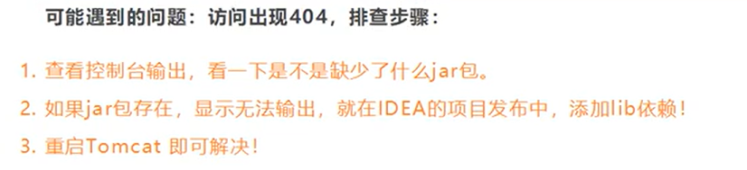
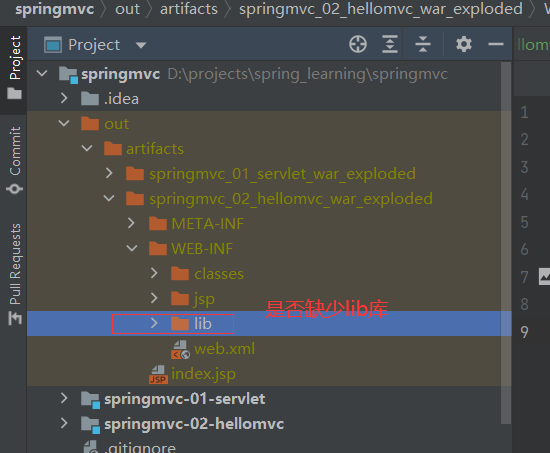
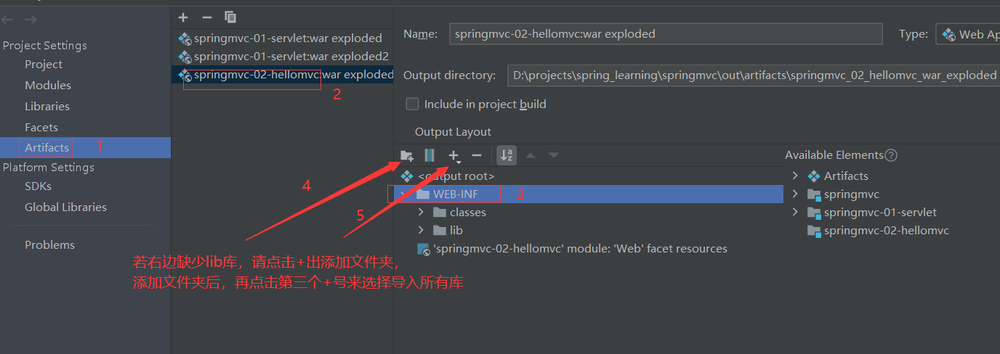
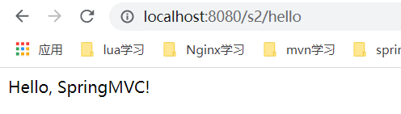
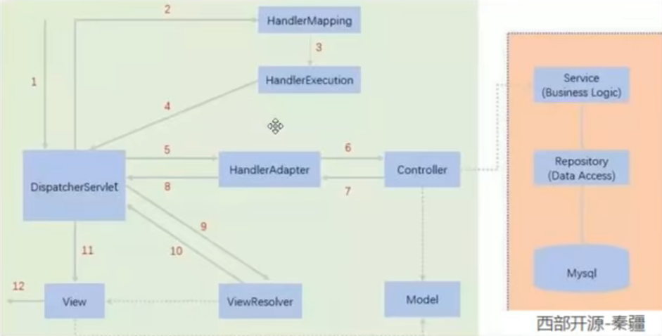
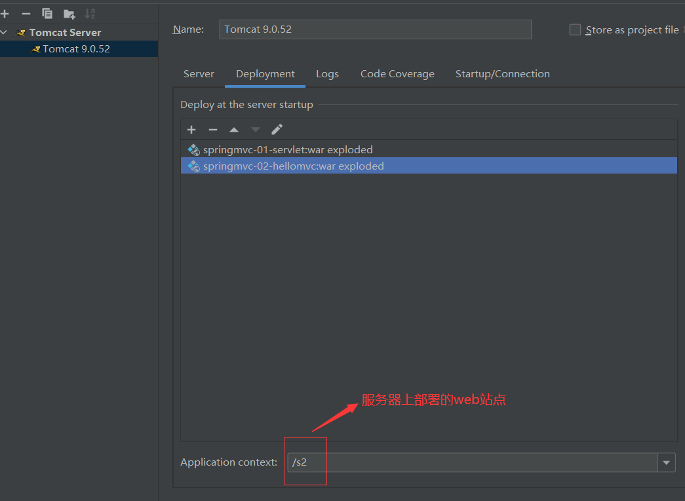
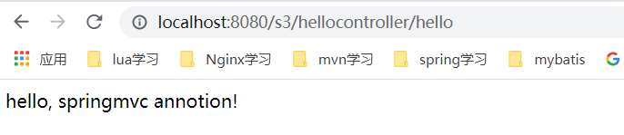
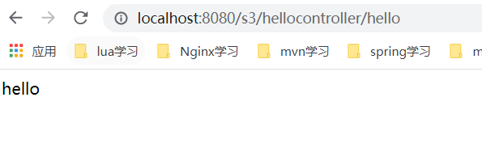

# SpringMVC
## 第一个MVC程序
参见springmvc-02-hellomvc

可能出现的报错如下：



应用程序打包发布时必须包含所必须的lib库，可以查看打出的war包是否包含lib，如下：



如缺少，可以采用如下方式添加：



实例如下：
```xml
<?xml version="1.0" encoding="UTF-8"?>
<beans xmlns="http://www.springframework.org/schema/beans"
       xmlns:xsi="http://www.w3.org/2001/XMLSchema-instance"
       xsi:schemaLocation="http://www.springframework.org/schema/beans
       http://www.springframework.org/schema/beans/spring-beans.xsd">

    <!--  根据bean的name来进行url的转发处理，如下面name="/hello"的处理方式  -->
    <bean class="org.springframework.web.servlet.handler.BeanNameUrlHandlerMapping"/>
    <bean class="org.springframework.web.servlet.mvc.SimpleControllerHandlerAdapter"/>

    <bean id="InternalResourceViewResolver" class="org.springframework.web.servlet.view.InternalResourceViewResolver">
        <!--   前缀     -->
        <property name="prefix" value="/WEB-INF/jsp/"></property>
        <!--   后缀     -->
        <property name="suffix" value=".jsp"></property>
    </bean>

    <bean id="/hello" class="com.huang.controller.HelloController"/>
</beans>
```



### SpringMVC执行流程




上图为SpringMVC的一个较为完整的流程图，实现表示SpringMVC框架提供的技术，不需要开发者
实现，虚线表示需要开发者实现。

**简要分析其执行流程**

1、DispatcherServlet表示前端控制器，是整个SpringMVC的控制中心。用户发出请求，DispatcherServlet
接收请求并拦截请求。
* 我们假设请求的url为http://localhost:8080/SpringMVC/hello
* 如上url可以拆成三个部分：

（1）http://localhost:8080为服务器域名
（2）SpringMVC部署在服务器上的web站点

（3）hello表示控制器

* 通过分析，如上url表示为：请求位于服务器http://localhost:8080的SpringMVC站点的
hello控制器。

2、HandlerMapping为处理器映射。DispatcherServlet调用HandlerMapping，HandlerMapping
根据请求url查找handler。

3、HandlerExcuution表示具体的handler，其主要作用是根据url查找控制器，如上url查找
控制器为：hello。

4、HandlerExcuution将解析后的信息传递给DispatcherServlet，如解析控制器映射等。

5、HandlerAdapter表示处理器适配器。其按照特定的规则去执行Handler。

6、Handler让具体的Controller去执行。对应上例中的HelloController。

7、Controller将具体的执行信息返回给HandlerAdapter，如返回ModelAndView。

8、HandlerAdapter将视图逻辑名或模型传递给DispatcherServlet。

9、DispatcherServlet调用视图解析器（ViewResolver）来解析HandlerAdapter传递过来的逻辑视图名。

10、视图解析器将解析的逻辑视图名传递给DispatcherServlet。

11、DispatcherServlet根据视图解析器解析的视图结果，调用具体的视图。

12、最终视图呈现给用户。

## 注解实现springmvc的第一个例子
如springmvc-03-annotation所示
```xml
<?xml version="1.0" encoding="UTF-8"?>
<beans xmlns="http://www.springframework.org/schema/beans"
       xmlns:xsi="http://www.w3.org/2001/XMLSchema-instance"
       xmlns:context="http://www.springframework.org/schema/context"
       xmlns:mvc="http://www.springframework.org/schema/mvc"
       xsi:schemaLocation="http://www.springframework.org/schema/beans
       http://www.springframework.org/schema/beans/spring-beans.xsd
       http://www.springframework.org/schema/context
       http://www.springframework.org/schema/context/spring-context.xsd
       http://www.springframework.org/schema/mvc
       http://www.springframework.org/schema/mvc/spring-mvc.xsd">
    <!--自动扫描包，让指定包下的注解生效，由IOC容器统一管理-->
    <context:component-scan base-package="com.huang.controller"/>
    <!--让springmvc不处理静态资源， .css   .html  .js .mp3  .mp4等等    -->
    <mvc:default-servlet-handler/>

    <!--
      支持mvc注解驱动
        在spring中一般采用@ResourceMapping注解来完成映射关系
        要想使@ResourceMapping生效，必须向上下文注册DefaultAnnotationHandlerMapping
        和一个AnnotationMethodHandlerAdapter实例
        这两个实例分别在类级别和方法级别处理。
        而annotation-driven配置帮助我们自动完成上述两个实例的注入！
      -->
    <mvc:annotation-driven/>

    <!--  视图解析器  -->
    <bean class="org.springframework.web.servlet.view.InternalResourceViewResolver" id="internalResourceViewResolver">
        <property name="prefix" value="/WEB-INF/jsp/"/>
        <property name="suffix" value=".jsp"/>
    </bean>
</beans>
```

```java
package com.huang.controller;

import org.springframework.stereotype.Controller;
import org.springframework.ui.Model;
import org.springframework.web.bind.annotation.RequestMapping;

/**
 * @ClassName HelloAnnoController
 * @Description TODO
 * @Author huangbo1221
 * @Date 2022/2/15 21:33
 * @Version 1.0
 */
@Controller
@RequestMapping("/hellocontroller")
public class HelloAnnoController {

//    真实访问地址：/hellocontroller/hello
    @RequestMapping("/hello")
    public String sayHello(Model model) {
        // 向模型中添加属性msg的值，可以在jsp中取出并渲染
        model.addAttribute("msg", "hello, springmvc annotion!");
        // WEB-INF/jsp/hello.jsp
        return "hello";
    }
}
```

上面这个例子的输出如下：



经过了视图解析器的渲染，跳转到了hello.jsp

将@Controller改变为@RestController，输出如下



可见，最终的结果是没有经过视图解析器的。@RestController不用结果视图解析器！