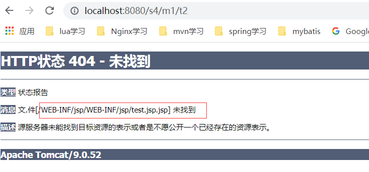
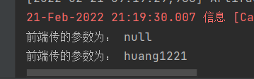
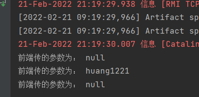
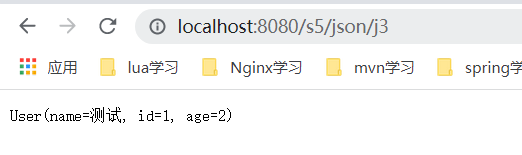

# SpringMVC
## 第一个MVC程序
参见springmvc-02-hellomvc

可能出现的报错如下：


应用程序打包发布时必须包含所必须的lib库，可以查看打出的war包是否包含lib，如下：


如缺少，可以采用如下方式添加：


实例如下：
```xml
<?xml version="1.0" encoding="UTF-8"?>
<beans xmlns="http://www.springframework.org/schema/beans"
       xmlns:xsi="http://www.w3.org/2001/XMLSchema-instance"
       xsi:schemaLocation="http://www.springframework.org/schema/beans
       http://www.springframework.org/schema/beans/spring-beans.xsd">

    <!--  根据bean的name来进行url的转发处理，如下面name="/hello"的处理方式  -->
    <bean class="org.springframework.web.servlet.handler.BeanNameUrlHandlerMapping"/>
    <bean class="org.springframework.web.servlet.mvc.SimpleControllerHandlerAdapter"/>

    <bean id="InternalResourceViewResolver" class="org.springframework.web.servlet.view.InternalResourceViewResolver">
        <!--   前缀     -->
        <property name="prefix" value="/WEB-INF/jsp/"></property>
        <!--   后缀     -->
        <property name="suffix" value=".jsp"></property>
    </bean>

    <bean id="/hello" class="com.huang.controller.HelloController"/>
</beans>
```


### SpringMVC执行流程


上图为SpringMVC的一个较为完整的流程图，实现表示SpringMVC框架提供的技术，不需要开发者
实现，虚线表示需要开发者实现。

**简要分析其执行流程**

1、DispatcherServlet表示前端控制器，是整个SpringMVC的控制中心。用户发出请求，DispatcherServlet
接收请求并拦截请求。
* 我们假设请求的url为http://localhost:8080/SpringMVC/hello
* 如上url可以拆成三个部分：

（1）http://localhost:8080为服务器域名
（2）SpringMVC部署在服务器上的web站点

（3）hello表示控制器

* 通过分析，如上url表示为：请求位于服务器http://localhost:8080的SpringMVC站点的
hello控制器。

2、HandlerMapping为处理器映射。DispatcherServlet调用HandlerMapping，HandlerMapping
根据请求url查找handler。

3、HandlerExcuution表示具体的handler，其主要作用是根据url查找控制器，如上url查找
控制器为：hello。

4、HandlerExcuution将解析后的信息传递给DispatcherServlet，如解析控制器映射等。

5、HandlerAdapter表示处理器适配器。其按照特定的规则去执行Handler。

6、Handler让具体的Controller去执行。对应上例中的HelloController。

7、Controller将具体的执行信息返回给HandlerAdapter，如返回ModelAndView。

8、HandlerAdapter将视图逻辑名或模型传递给DispatcherServlet。

9、DispatcherServlet调用视图解析器（ViewResolver）来解析HandlerAdapter传递过来的逻辑视图名。

10、视图解析器将解析的逻辑视图名传递给DispatcherServlet。

11、DispatcherServlet根据视图解析器解析的视图结果，调用具体的视图。

12、最终视图呈现给用户。

## 注解实现springmvc的第一个例子
如springmvc-03-annotation所示
```xml
<?xml version="1.0" encoding="UTF-8"?>
<beans xmlns="http://www.springframework.org/schema/beans"
       xmlns:xsi="http://www.w3.org/2001/XMLSchema-instance"
       xmlns:context="http://www.springframework.org/schema/context"
       xmlns:mvc="http://www.springframework.org/schema/mvc"
       xsi:schemaLocation="http://www.springframework.org/schema/beans
       http://www.springframework.org/schema/beans/spring-beans.xsd
       http://www.springframework.org/schema/context
       http://www.springframework.org/schema/context/spring-context.xsd
       http://www.springframework.org/schema/mvc
       http://www.springframework.org/schema/mvc/spring-mvc.xsd">
    <!--自动扫描包，让指定包下的注解生效，由IOC容器统一管理-->
    <context:component-scan base-package="com.huang.controller"/>
    <!--让springmvc不处理静态资源， .css   .html  .js .mp3  .mp4等等    -->
    <mvc:default-servlet-handler/>

    <!--
      支持mvc注解驱动
        在spring中一般采用@ResourceMapping注解来完成映射关系
        要想使@ResourceMapping生效，必须向上下文注册DefaultAnnotationHandlerMapping
        和一个AnnotationMethodHandlerAdapter实例
        这两个实例分别在类级别和方法级别处理。
        而annotation-driven配置帮助我们自动完成上述两个实例的注入！
      -->
    <mvc:annotation-driven/>

    <!--  视图解析器  -->
    <bean class="org.springframework.web.servlet.view.InternalResourceViewResolver" id="internalResourceViewResolver">
        <property name="prefix" value="/WEB-INF/jsp/"/>
        <property name="suffix" value=".jsp"/>
    </bean>
</beans>
```

```java
package com.huang.controller;

import org.springframework.stereotype.Controller;
import org.springframework.ui.Model;
import org.springframework.web.bind.annotation.RequestMapping;

/**
 * @ClassName HelloAnnoController
 * @Description TODO
 * @Author huangbo1221
 * @Date 2022/2/15 21:33
 * @Version 1.0
 */
@Controller
@RequestMapping("/hellocontroller")
public class HelloAnnoController {

//    真实访问地址：/hellocontroller/hello
    @RequestMapping("/hello")
    public String sayHello(Model model) {
        // 向模型中添加属性msg的值，可以在jsp中取出并渲染
        model.addAttribute("msg", "hello, springmvc annotion!");
        // WEB-INF/jsp/hello.jsp
        return "hello";
    }
}
```

上面这个例子的输出如下：


经过了视图解析器的渲染，跳转到了hello.jsp

将@Controller改变为@RestController，输出如下


可见，最终的结果是没有经过视图解析器的。@RestController不用结果视图解析器！

## restful风格


eg1：
```java
// 非restful风格的访问方式
@RequestMapping("/r1")
public String test1(int a, int b, Model model) {
    int res = a + b;
    model.addAttribute("msg", "test1 method! res:" + res);
    return "test";
}
```


```java
 // restful风格的访问方式
@RequestMapping("/r2/{a}/{b}")
public String test2(@PathVariable int a, @PathVariable int b, Model model) {
    int res = a + b;
    model.addAttribute("msg", "test2 method! res:" + res);
    return "test";
    }

// restful风格的访问方式
@RequestMapping(value = "/r3/{a}/{b}", method = RequestMethod.GET)
public String test3(@PathVariable int a, @PathVariable int b, Model model) {
    int res = a + b;
    model.addAttribute("msg", "test3 method! res:" + res);
    return "test";
    }

// restful风格的访问方式
@GetMapping(value = "/r4/{a}/{b}")
public String test4(@PathVariable int a, @PathVariable int b, Model model) {
    int res = a + b;
    model.addAttribute("msg", "test4 method! res:" + res);
    return "test";
    }
```


两次请求的风格是不一样的，restful风格可以根据资源的形式来完成请求！

## 视图解析器是否一定要在spring的xml文件进行配置？
其实是可以删除的，如下：
```xml
<?xml version="1.0" encoding="UTF-8"?>
<beans xmlns="http://www.springframework.org/schema/beans"
       xmlns:xsi="http://www.w3.org/2001/XMLSchema-instance"
       xmlns:context="http://www.springframework.org/schema/context"
       xmlns:mvc="http://www.springframework.org/schema/mvc"
       xsi:schemaLocation="http://www.springframework.org/schema/beans
       http://www.springframework.org/schema/beans/spring-beans.xsd
       http://www.springframework.org/schema/context
       https://www.springframework.org/schema/context/spring-context.xsd
       http://www.springframework.org/schema/mvc
       https://www.springframework.org/schema/mvc/spring-mvc.xsd">

    <context:component-scan base-package="com.huang.controller"/>
    <mvc:default-servlet-handler/>
    <mvc:annotation-driven/>

<!--    <bean class="org.springframework.web.servlet.view.InternalResourceViewResolver" id="internalResourceViewResolver">-->
<!--        <property name="prefix" value="/WEB-INF/jsp/"/>-->
<!--        <property name="suffix" value=".jsp"/>-->
<!--    </bean>-->

    <bean id="/hello" class="com.huang.controller.Test1Controller"/>
</beans>
```

视图解析器已经被注释掉了，然后再看看下面的用例！

### 方式一：
```java
package com.huang.controller;

import org.springframework.stereotype.Controller;
import org.springframework.web.bind.annotation.RequestMapping;

import javax.servlet.ServletException;
import javax.servlet.http.HttpServletRequest;
import javax.servlet.http.HttpServletResponse;
import java.io.IOException;

/**
 * @ClassName ModuleTest01
 * @Description TODO
 * @Author huangbo1221
 * @Date 2022/2/17 22:29
 * @Version 1.0
 */
@Controller
public class ModuleTest01 {
    @RequestMapping("m1/t1")
    public void test01(HttpServletRequest request, HttpServletResponse response) throws ServletException, IOException {
        request.setAttribute("msg", "ModuleTest01的ModuleTest01");
        request.getRequestDispatcher("/WEB-INF/jsp/test.jsp").forward(request, response);
    }
}

```

输出如下：


参考如下例子实验


### 方式二：
```java
@RequestMapping("m1/t2")
public String test02(Model model){
    model.addAttribute("msg", "ModuleTest01的test02");
    // 视图解析器若存在，则会先走视图解析器拼接，然后转发到指定路径
    return "/WEB-INF/jsp/test.jsp";
}
```
结果如下：


但是要记住，上面方式二是在注释掉视图解析器的情况下，若视图解析器存在，且设置了一定的值！
```xml
<bean class="org.springframework.web.servlet.view.InternalResourceViewResolver" id="internalResourceViewResolver">
    <property name="prefix" value="/WEB-INF/jsp/"/>
    <property name="suffix" value=".jsp"/>
</bean>
```
则结果输出如下：



方法返回值与视图解析器的路径进行了拼接！

### 方式三
视图解析器存在的情况下：
```xml
<?xml version="1.0" encoding="UTF-8"?>
<beans xmlns="http://www.springframework.org/schema/beans"
       xmlns:xsi="http://www.w3.org/2001/XMLSchema-instance"
       xmlns:context="http://www.springframework.org/schema/context"
       xmlns:mvc="http://www.springframework.org/schema/mvc"
       xsi:schemaLocation="http://www.springframework.org/schema/beans
       http://www.springframework.org/schema/beans/spring-beans.xsd
       http://www.springframework.org/schema/context
       https://www.springframework.org/schema/context/spring-context.xsd
       http://www.springframework.org/schema/mvc
       https://www.springframework.org/schema/mvc/spring-mvc.xsd">

    <context:component-scan base-package="com.huang.controller"/>
    <mvc:default-servlet-handler/>
    <mvc:annotation-driven/>

    <bean class="org.springframework.web.servlet.view.InternalResourceViewResolver" id="internalResourceViewResolver">
        <property name="prefix" value="/WEB-INF/jsp/"/>
        <property name="suffix" value=".jsp"/>
    </bean>

    <bean id="/hello" class="com.huang.controller.Test1Controller"/>
</beans>
```

```java

```
输出如下：


表明加了前缀forward，则直接转发到指定的路径

### 方式四
在存在上述视图解析器的情况下
```java
@RequestMapping("m1/t4")
public String test04(Model model){
    model.addAttribute("msg", "ModuleTest01的test04");
    // 重定向转发到指定路径
    return "redirect:/WEB-INF/jsp/test.jsp";
}
```

结果如下：
执行如下get请求


结果：


因为jsp目录位于WEB-INF下，但是WEB-INF目录时服务器级别，对客户端隐藏的，因此访问不到！

代码修改如下：
```java
@RequestMapping("m1/t4")
public String test04(Model model){
    model.addAttribute("msg", "ModuleTest01的test04");
    // 重定向转发到指定路径
    return "redirect:/index.jsp";
}
```

结果如下：


## 处理提交数据
controller代码如下：
```java
package com.huang.controller;

import org.springframework.stereotype.Controller;
import org.springframework.ui.Model;
import org.springframework.web.bind.annotation.RequestMapping;

/**
 * @ClassName UserController
 * @Description TODO
 * @Author huangbo1221
 * @Date 2022/2/21 21:03
 * @Version 1.0
 */
@Controller
@RequestMapping("/user")
public class UserController {
    @RequestMapping("/t1")
    public String test01(String name, Model model) {
        System.out.println("前端传的参数为： " + name);

        model.addAttribute("msg", name);

        return "test";
    }
}
```

eg1:


eg2:




eg3:




可见，只能识别到name。此时，可以用注解指定参数。如下：


eg4:


eg5:


服务器指定了需要@RequestParam("userName")参数！

```java
@RequestMapping("t2")
public String test02(User user, Model model) {
    System.out.println(user);
    model.addAttribute("msg", "success!");
    return "test";
}
```

eg6:


eg7:


* 1、接收前端用户传递的参数，判断参数的名字，假设名字直接在方法上，可以直接使用
* 2、假设传递的是一个User对象，匹配User对象中的字段名，如果名字一致则匹配成功，否则匹配不上。

## 解决乱码
### 方式1


### 方式2：利用Spring自带的过滤器功能
测试准备：

表单jsp创建如下：
```html
<%--
  Created by IntelliJ IDEA.
  User: 15603
  Date: 2022/2/21
  Time: 21:52
  To change this template use File | Settings | File Templates.
--%>
<%@ page contentType="text/html;charset=UTF-8" language="java" %>
<html>
<head>
    <title>表单</title>
</head>
<body>
<form action="${pageContext.request.contextPath}/user/t3" method="post">
    <input type="text" name="name">
    <input type="submit">
</form>
</body>
</html>
```
java代码
```java
@RequestMapping("/t3")
public String test04(String name, Model model) {
    System.out.println(name);
    model.addAttribute("msg", name);
    return "test";
}
```

eg1：


可见回显时是乱码。

解决方式如下：
web.xml配置过滤器
```xml
<filter>
    <filter-name>characterencoding</filter-name>
    <filter-class>org.springframework.web.filter.CharacterEncodingFilter</filter-class>
    <init-param>
        <param-name>encoding</param-name>
        <param-value>utf-8</param-value>
    </init-param>
</filter>
<filter-mapping>
    <filter-name>characterencoding</filter-name>
    <url-pattern>/*</url-pattern>
</filter-mapping>
```
验证结果如下：


**注意**
filter拦截器的<url-pattern>不要设置成/！！！
如下：
```xml
<filter>
    <filter-name>characterencoding</filter-name>
    <filter-class>org.springframework.web.filter.CharacterEncodingFilter</filter-class>
    <init-param>
        <param-name>encoding</param-name>
        <param-value>utf-8</param-value>
    </init-param>
</filter>
<filter-mapping>
    <filter-name>characterencoding</filter-name>
    <url-pattern>/</url-pattern>
</filter-mapping>
```

验证结果如下：


仍然是乱码。

因为/表示拦截所有请求（不带扩展名！！！）
http://localhost:8080/s4/form.jsp  这个请求带了.jsp的扩展

而/*表示拦截所有请求！

## 了解json（javascript object notation， js对象标记）
json键值对是用来保存JavaScript对象的一种方式，和JavaScript对象的写法也大同小异。


### javascript举例
```html
<!DOCTYPE html>
<html lang="en">
<head>
    <meta charset="UTF-8">
    <title>Title</title>
</head>
<body>
<!--script这个标签不要搞自闭和标签-->
    <script>
        var user = {
            id : "1",
            name: "测试",
            age : "2"
        }
        console.log(user)
        console.log("======================")

    //    将js对象转化为json
        var json = JSON.stringify(user)
        console.log(json)
        console.log("======================")

        // 将json转换为js对象
        var obj = JSON.parse(json)
        console.log(obj)
    </script>
</body>
</html>
```


### 解决乱码还有其他的方式，如下
```java
@RequestMapping("/j2")
@ResponseBody // 表示直接返回给前端渲染，不经过视图解析器
public String test02 () {
   User user = new User("测试", 1, 2);
   return user.toString();
}
```
测试结果如下：


上面的例子可以看出，没有经过filter过滤器时，会造成返回文本的乱码。
此时，可以设置下面的方式解决：

```java
@RequestMapping(value = "/j3", produces = "application/json;charset=utf-8")
@ResponseBody
public String test03 () {
    User user = new User("测试", 1, 2);
    return user.toString();
}
```



主动设置了返回体produces = "application/json;charset=utf-8"格式

```java
@RequestMapping(value = "/j4", produces = "application/json;charset=utf-8")
@ResponseBody
public String test04() throws JsonProcessingException {
    ObjectMapper objectMapper = new ObjectMapper();
    User user1 = new User("测试1", 1, 2);
    User user2 = new User("测试2", 1, 2);
    User user3 = new User("测试3", 1, 2);
    User user4 = new User("测试4", 1, 2);

    List<User> users = new ArrayList<>();
    users.add(user1);
    users.add(user2);
    users.add(user3);
    users.add(user4);

    String valueAsString = objectMapper.writeValueAsString(users);
    return valueAsString;
}
```

输出如下：


输出为json化的格式数据

输出日期数据
```java
@RequestMapping("/j5")
public String test05() {
    Date date = new Date();
    SimpleDateFormat simpleDateFormat = new SimpleDateFormat("yyyy-MM-dd hh:mm:ss");
    return simpleDateFormat.format(date);
}
```

yyyy-MM-dd hh:mm:ss 这里的占位符字母一定要不一样，否则就会被后面的字符所代表的数字覆盖

输出如下：


